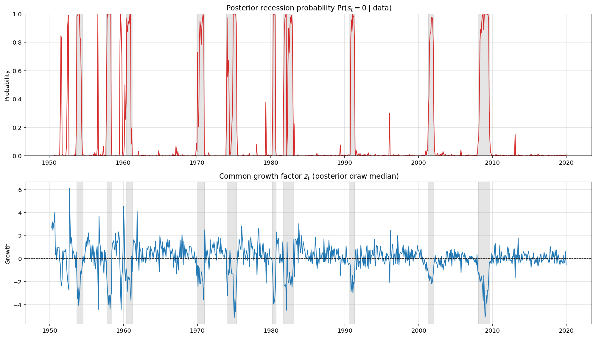
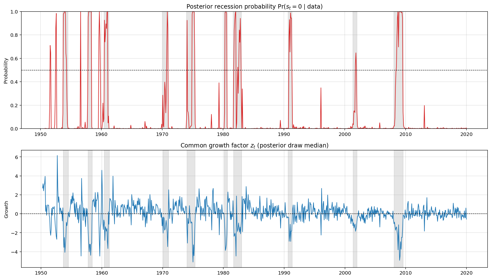
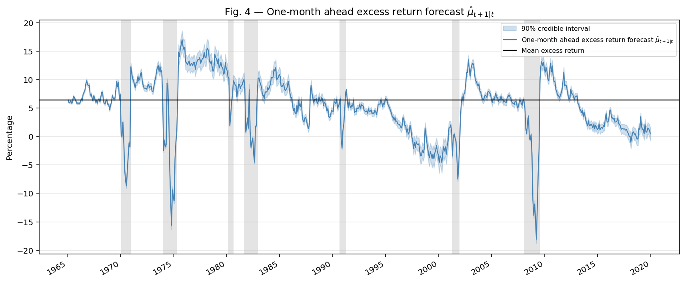
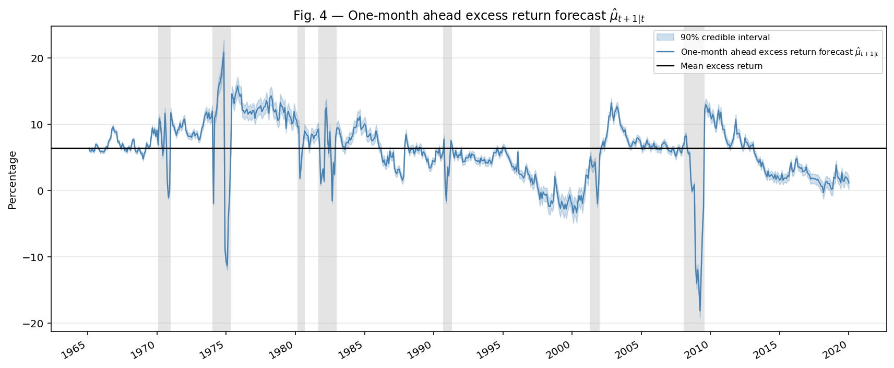

# Late to Recessions: Stocks and the Business Cycle — Python Replication

> **Python replication of:** Gómez-Cram, R. (2022). Late to Recessions: Stocks and the Business Cycle. *Journal of Finance*, 77(2), 923–966. DOI: [10.1111/jofi.13100](https://doi.org/10.1111/jofi.13100)

---

## Table of Contents
1. [Paper Overview](#1-paper-overview)
2. [Methodology](#2-methodology)
3. [Data Sources & Replication Notes](#3-data-sources--replication-notes)
4. [How to Run the Code](#4-how-to-run-the-code)
5. [Results](#5-results)

---

## 1. Paper Overview

Gómez-Cram (2022) documents stock returns are predictably negative for several months following the onset of recessions, only turning strongly positive thereafter — producing a pronounced V-shape in the equity premium around business cycle turning points.

The paper's central contributions are:

- **Business cycle identification** via a state-space model combining Kalman and Hamilton filters, estimated on macroeconomic (and financial — see Section 3) data and agnostic about NBER recession dates.
- **Return predictability** that is state-dependent: during recessions, returns exhibit momentum consistent with slow investor reaction, while during expansions they show mild reversals consistent with discount-rate changes.

This repository provides a Python replication of the state-space estimation and the expected excess equity return measure.

---

## 2. Methodology

### 2.1 The State-Space Model (Business Cycle Identification)

At the heart of the paper is a latent factor model that extracts a common business cycle signal from a panel of macroeconomic and financial indicators. Each observed series $y_{i,t}$ is linked to a scalar common growth factor $z_t$ via the observation equation:

$$y_{i,t} = \gamma_i z_t + \varepsilon_{i,t}$$

where $\gamma_i$ is the factor loading and $\varepsilon_{i,t}$ follows an AR(1) idiosyncratic process:

$$\varepsilon_{i,t} = \psi_i \varepsilon_{i,t-1} + e_{i,t}, \qquad e_{i,t} \sim \mathcal{N}(0, \sigma^2_{e,i})$$

Series are z-scored before estimation so no intercept is needed. The common growth factor itself follows a Markov-switching AR(1) process governed by a hidden binary state $s_t \in \{0, 1\}$, where $s_t = 0$ denotes recession and $s_t = 1$ expansion:

$$z_t = \mu(s_t) + \phi_z\, z_{t-1} + \eta_t, \qquad \eta_t \sim \mathcal{N}(0, \sigma^2_\eta)$$

with $\mu(s_t) = \mu_0 + \mu_1 s_t$ and the constraint $\mu_1 > 0$ ensuring the expansion mean exceeds the recession mean.

The model handles both monthly (series 1–12) and quarterly (series 13–15) data simultaneously using the Mariano-Murasawa temporal aggregation, which links quarterly observations to the sum of monthly latent factor values within a quarter.

What makes the model elegant is how the two filters interact:

- The **Kalman filter** propagates the continuous latent factor $z_t$ given the observed data, providing filtered state estimates and prediction-error variances.
- The **Hamilton filter** propagates the discrete recession probability $\Pr(s_t = 0 \mid \mathcal{F}_t)$, collapsing the Gaussian mixture that arises from conditioning on $s_t$ back to a single Gaussian at each step — a standard approximation that keeps the recursion tractable.

The joint filter alternates between these two steps at each observation, producing a filtered recession probability that is entirely data-driven.

### 2.2 Bayesian Estimation with Conjugate Priors

The model is estimated via Bayesian MCMC (Gibbs sampling). The two latent states are drawn using different algorithms. The continuous factor $z_t$ is drawn via Forward Filtering, Forward Sampling (FFFS): at each step $t$, the filtered distribution conditional on data up to $t$ is:

$$z_t \mid \mathcal{F}_t \sim \mathcal{N}(\hat{z}_{t \mid t},\; P_{t \mid t})$$

The discrete regime $S_t$ is drawn via the Carter-Kohn backward simulation smoother applied to the Hamilton filter output, sampling the full path $S_{1:T}$ backward from $T$ to $1$ conditioning on future regime draws.

A particularly noteworthy methodological choice is the use of loose, conjugate priors throughout:

- Factor loadings $\gamma_i$ and idiosyncratic variances $\sigma^2_{e,i}$ are assigned Normal-Inverse-Gamma priors, so their full conditionals remain Normal-Inverse-Gamma — analytically tractable.
- The AR coefficient $\phi_z$ and regime-specific means $[\mu_0, \mu_1]$ are assigned Normal priors, yielding Normal full conditionals.
- Transition probabilities receive Beta(1,1) = Uniform priors, conjugate to the Binomial likelihood implied by the Hamilton filter's regime allocation, expressing no prior information on regime persistence.

This structural choice — loose enough priors to let the data dominate, conjugate enough to keep every conditional in closed form — means the sampler never requires Metropolis-Hastings steps. Every draw is exact, mixing is fast, and the posterior geometry is well-behaved.

### 2.3 Expected Excess Equity Returns

Separately from the business cycle identification, the paper estimates a predictive regression for one-month-ahead excess equity returns:

$$r_{t+1}^e = \alpha + \beta\, \hat{z}_t + \delta\, \hat{z}_{t-1} + \epsilon_{t+1}$$

where ẑ_t is the posterior median of the common growth factor and r^e_{t+1} is the U.S. market excess return (Rm−Rf) from the [Kenneth R. French Data Library](https://mba.tuck.dartmouth.edu/pages/faculty/ken.french/data_library.html). The sign and magnitude of $\beta$ across regimes — negative early in recessions, strongly positive thereafter — is the paper's central empirical finding.

---

## 3. Data Sources & Replication Notes

### 3.1 Identified Series

The author provides a MATLAB dataset for replication but does not document its contents. Through systematic correlation analysis against public data sources, the following 15 series were identified. Correlations are computed over the author's 1950–2019 sample on z-scored series.

| # | Series | Correlation (Jan 1950–Dec 2019) | n |
|---|--------|------------------------|---|
| 1 | Industrial Production (SA, Log MoM, Last Vintage) | +1.0000*** | 835 |
| 2 | Non-Farm Payrolls (SA, Log MoM, Real-Time) | +0.9842*** | 838 |
| 3 | PCE (SA, Log MoM, Real-Time) | +0.9706*** | 635 |
| 4 | Real Private Income ex. Transfers (SA, Log MoM, Last Vintage) | +0.9928*** | 731 |
| 5 | Aggregate Weekly Hours (SA, Log MoM, Philly Fed RT) | +0.9024*** | 623 |
| 6 | Initial Claims (SA, Log, 11m negated, Last Vintage) | +0.9992*** | 625 |
| 7 | S&P 500 (Log YoY) | +0.8226*** | 839 |
| 8 | 10Y–2Y Treasury Spread | +1.0000*** | 523 |
| 9 | TED Spread (negated) | +1.0000*** | 408 |
| 10 | BAA–AAA Spread (negated) | +0.9999*** | 408 |
| 11 | 10Y Breakeven Inflation | +1.0000*** | 204 |
| 12 | VIX (negated) | +1.0000*** | 360 |
| 13 | Nominal GDP (SA, Log QoQ, Real-Time) | +0.9890*** | 279 |
| 14 | Nominal Residential Fixed Investment (SA, Log QoQ, Real-Time) | +0.9937*** | 274 |
| 15 | Nominal Non-Residential Fixed Investment (SA, Log QoQ, Real-Time) | +0.9891*** | 274 |

*\*\*\* p < 0.01. Series 4 correlation is post-correction for the Microsoft special dividend artifact (see Section 4.5).*

### 3.2 Replication Observations

Two observations emerged from the data identification exercise that are worth flagging for transparency.

**Financial variables in the dataset (series 7–12).** The paper describes a state-space model driven by macroeconomic indicators and makes no mention of financial market variables in the model's specification. Yet the author's replication dataset contains six financial series: YoY equity returns (closest match was S&P 500 YoY price returns), the yield curve slope (2s10s), the TED spread, the BAA–AAA credit spread, 10-year breakeven inflation, and the VIX. Removing these series from the estimation causes the identified recession turning points to lag noticeably — suggesting they carry meaningful weight in the identification. The role of these series relative to the paper's stated methodology is not discussed in the paper.

**Vintage selection and publication lags.** Correlation analysis revealed that the author's data sometimes aligns more closely with revised (ex-post) vintages than with the real-time vintages available at the time of original publication for several series. In a model that explicitly aims to date recessions in real time, the use of revised data — if confirmed — would overstate the timeliness of the model's recession signal, as revised figures benefit from information not available to contemporaneous observers.

---

## 4. How to Run the Code

### 4.1 Prerequisites

```bash
pip install numpy scipy pandas matplotlib statsmodels numba fredapi yfinance openpyxl requests
```

Python 3.9+ is recommended. A free FRED API key is required (register at [fred.stlouisfed.org](https://fred.stlouisfed.org/docs/api/api_key.html)).

### 4.2 Project Structure


```
Late_to_recessions_JF2022_Python_Replication/
├── Original_Paper/
│   ├── Matlab code/                        ← Original MATLAB code provided by the author
│   ├── late to recession internet-appendix.pdf
│   └── ssrn_id3873755_code2626202.pdf
├── Python_Version/
│   ├── README.md
│   ├── StateBusinessCycle/
│   │   ├── main_BC.py                      ← Main orchestrator: runs full Gibbs sampler and saves output
│   │   ├── Data/
│   │   │   ├── dataMacroFinance_1950_2019_updated.mat  ← Author's original MATLAB dataset
│   │   │   ├── hMvMd.xlsx                  ← Philly Fed aggregate weekly hours (download separately)
│   │   │   └── GC_jf2022_dataset_replicate.pkl        ← Built by build_macro_dataset.py
│   │   └── Functions/
│   │       ├── build_macro_dataset.py      ← Downloads all 15 series, applies corrections, saves pkl
│   │       ├── initialValuesMacro.py       ← OLS-based starting values for all Gibbs parameters
│   │       ├── generate_xt_sv.py           ← Kalman filter + forward sampling (FFFS) for z_t
│   │       ├── hamiltonfilter_xt_sv.py     ← Hamilton forward filter + Carter-Kohn backward draw for S_t
│   │       ├── get_coefficients_sv.py      ← Builds state-space matrices (H, F, Q) from parameters
│   │       ├── gibbSamplingMacro.py        ← One Gibbs sweep: draws (ψ_i, σ²_{e,i}) then γ_i for each series
│   │       ├── generate_gamma_macro.py     ← Draws factor loadings γ_i from Normal posterior
│   │       ├── generate_PSIandSIG_macro.py ← Draws idiosyncratic AR coefficients ψ_i and variances σ²_{e,i}
│   │       ├── generate_MU_PHI_sv.py       ← Draws common factor parameters φ_z, μ_0, μ_1 via GLS
│   │       ├── generate_ChangeState.py     ← Counts Markov transition events for Beta posterior draws
│   │       ├── specifyPriorsGibbsMacro.py  ← Prior hyperparameters matching Table IV of the paper
│   │       ├── bingen.py                   ← Binary random draw utility
│   │       └── utils.py                    ← Shared numerical utilities (Cholesky, RNG, symmetrisation)
│   └── ExpectedReturnMeasure/
│       ├── main_ERF.py                     ← Main orchestrator: MH sampler for excess return parameters
│       ├── Data/
│       │   ├── commonGrowthData.npz        ← Business cycle output from main_BC.py
│       │   ├── returnData.csv              ← Excess equity return series
│       │   └── para.txt                    ← Initial parameter values for MH sampler [μ_l, ρ_l, corr_s, φ_1, φ_2, h, σ²_1]
│       └── Functions/
│           ├── data_loader_er.py           ← Loads business cycle output and return data for main_ERF.py
│           ├── coefficients.py             ← Builds state-space matrices for the return model
│           ├── evalmod.py                  ← Single-regime Kalman filter + Rauch-Tung-Striebel simulation smoother
│           ├── evalmodMix.py               ← Mixture likelihood combining expansion and recession regimes
│           ├── objfcnMixStates.py          ← Log posterior objective function for MH sampler
│           ├── priors_er.py                ← Prior distributions and bounds for return model parameters
│           ├── recessionplot.py            ← Utility to overlay NBER recession shading on plots
│           └── utils.py                    ← Shared numerical utilities (Lyapunov solver, Cholesky, RNG)
└── README.md                               ← This file (repository root)
```

### 4.3 Running the Estimation

Run the two orchestrator files in order. All file paths are detected automatically from each script's location — no manual path editing is needed.

**Step 1 — Business cycle identification (`main_BC.py`):**

Open `Python_Version/StateBusinessCycle/main_BC.py` and run it. The script will:
- Download and build the dataset on first run (requires a FRED API key in the `USER CONFIGURATION` block)
- Run the Gibbs sampler (~18–25 minutes with Numba installed, longer without)
- Display Figure 1 (posterior recession probability and common growth factor)
- Print the BC model posterior percentiles to the console
- Save `commonGrowthData.npz` to `ExpectedReturnMeasure/Data/` automatically

**Step 2 — Expected excess return forecast (`main_ERF.py`):**

Open `Python_Version/ExpectedReturnMeasure/main_ERF.py` and run it. The script will:
- Load `commonGrowthData.npz` written by Step 1
- Run the Metropolis-Hastings sampler (~5–10 minutes)
- Display Figure 2 (one-month-ahead expected excess return forecast)
- Print the full Table IV posterior comparison to the console

**Environment note.** Both scripts were developed and tested in **Spyder** (Anaconda distribution). Running them with the green *Run file* button (`F5`) works out of the box because Spyder sets the working directory to the script's folder automatically. Other IDEs (VS Code, PyCharm, Jupyter) may require you to manually set the working directory to the script's folder before running, otherwise relative path resolution for `Data/` and `Functions/` may fail. From the command line the equivalent is:

```bash
cd Python_Version/StateBusinessCycle
python main_BC.py

cd ../ExpectedReturnMeasure
python main_ERF.py
```

### 4.4 Configuration

All user-facing settings are in the `USER CONFIGURATION` block at the top of `main_BC.py`. No other file needs to be edited.

| Parameter | Description |
|-----------|-------------|
| `FRED_API_KEY` | Your FRED API key for data download, can be obtained at https://fred.stlouisfed.org/docs/api/fred/ |
| `MODE` | `"replicate"` to match the author's 1950–2019 sample; `"latest"` to extend to the current date |
| `ZSCORE_METHOD` | `"fullsample"` (author's approach) or `"recursive"` (expanding-window, real-time compatible) |
| `ZSCORE_MIN_WINDOW` | Minimum observations before recursive z-score activates (default: 120 months) |
| `COVID_KAPPA_2020/2021/2022` | Variance scale factors for the pandemic window, following Holston, Laubach, and Williams (2023) |
| `REPLICATE_VINTAGE_CUTOFF` | Vintage date for ALFRED real-time data in replicate mode (default: `"2020-03-31"`) |
| `n0` | Gibbs burn-in draws to discard (default: 15,000) |
| `mm` | Posterior draws to retain after burn-in (default: 25,000) |
| `seed` | RNG seed for reproducibility (default: 1234) |

### 4.5 Data Notes

**FRED API and real-time data.** Series 2, 3, 5, 13, 14, and 15 use ALFRED real-time (first-release) vintages. Series 1, 4, and 6 use the current (last available) vintage. Financial series 7–12 use daily FRED data aggregated to monthly averages, except the S&P 500 which uses month-end closes from Yahoo Finance.

**Philly Fed aggregate weekly hours.** Series 5 requires the file `hMvMd.xlsx` from the [Philadelphia Fed Real-Time Data Research Center](https://www.philadelphiafed.org/surveys-and-data/real-time-data-research/h). Place it in the `Data/` folder before running.

**Microsoft special dividend correction (series 4).** The December 2004 release of W875RX1 (Real Private Income ex. Transfers) includes a $298.2 billion annualised distortion from the Microsoft special dividend of December 2, 2004 — a pure accounting artifact with no business-cycle content, as documented by the BEA ([bea.gov/help/faq/77](https://www.bea.gov/index.php/help/faq/77)). The $298.2 billion annualised nominal figure is deflated to chained 2017 dollars using the PCE price index ratio (PCEPI), matching the unit of account of the W875RX1 series, and then subtracted from the December 2004 level of the series before computing the log MoM difference.

### 4.6 A Note on COVID and Model Limitations

The Gomez-Cram (JF 2022) state-space model assumes i.i.d. Gaussian shocks with a time-invariant observation noise covariance R — an assumption well-suited to ordinary business cycle fluctuations but severely violated by the COVID-19 episode in two distinct ways.

**1. Extreme outliers.** The model's Gaussian likelihood assigns essentially zero probability to observations beyond 5–6σ. The March–April 2020 contractions are 10–20σ events under the estimated model. When included in estimation without correction, the Gibbs MLE must fit these observations within the same regime-specific Gaussian as 1970 or 2008 — so the recession regime mean $\mu_0$ and variance $\sigma^2_0$ are pulled toward COVID magnitudes, making every pre-COVID recession appear mild by comparison. The 2001 recession effectively vanishes from the posterior.

**2. Mechanical serial correlation from the V-shape recovery.** The model assumes serially uncorrelated measurement innovations. The shutdown (March–April 2020) followed by the reopening (May–June 2020) creates a mechanically negatively autocorrelated sequence of monthly growth rates — not because the business cycle turned, but because administrative restrictions were lifted. The Hamilton filter interprets this autocorrelation as regime-persistence signal, distorting the estimated transition probabilities $p$ and $q$ and making recessions appear shorter and more violent than the historical record warrants.

**Mitigation — time-varying variance scaling (HLW 2023).** Following Holston, Laubach & Williams (2023, NY Fed Staff Report 1063), this replication multiplies the measurement noise covariance R by a scale factor $\kappa_t$ during the pandemic window. In the Kalman gain:

$$K_t = P_{t|t-1} H' \left(H P_{t|t-1} H' + \kappa_t R\right)^{-1}$$

large $\kappa_t$ drives $K_t \to 0$, causing the filter to coast on the transition equation and effectively downweight the pandemic observations without discarding them. This is implemented by scaling observations by $1/\sqrt{\kappa_t}$, which is mathematically equivalent to multiplying R by $\kappa_t$. The $\kappa_t$ values are taken directly from HLW (2023) Table 1 (US estimates) and applied uniformly across all 15 series:

| Period | $\kappa_t$ | Observation weight |
|--------|-----------|-------------------|
| 2020 (Mar–Dec) | 9 | 1/9th of normal |
| 2021 | 1.8 | 1/1.8th of normal |
| 2022 | 1.7 | 1/1.7th of normal |
| All other periods | 1.000 | Full weight |

These corrections only partly restore pre-COVID recession identification. The fundamental incompatibility between a time-invariant Gaussian model and structural breaks of this magnitude remains. Results for the extended sample (adding the 2020–latest date period) are therefore inconclusive.

---

## 5. Results

### 5.1 Business Cycle: Posterior Recession Probability & Common Growth Factor

The figure below replicates Figure 1 of the paper. The top panel shows the filtered posterior recession probability $\Pr(s_t = 0 \mid \mathcal{F}_T)$ alongside NBER recession shading. The bottom panel shows the posterior median of the common growth factor $\hat{z}_t$.



The model successfully identifies all major NBER recessions, with the recession probability rising sharply at each turning point. The timing and shape closely match Figure 1 in the published paper, though — as discussed in Section 3 — results depend on the inclusion of financial variables not described in the original text.

For comparison, the figure below shows the same estimation run on macroeconomic series only (series 1–6 and 13–15), excluding the six financial variables: S&P 500 log return, 10Y–2Y Treasury spread, TED spread, BAA–AAA credit spread, 10Y breakeven inflation, and VIX (series 7–12).



Removing the financial series noticeably delays the model's recession signal at several turning points. This is expected: financial prices are forward-looking and embed market participants' expectations about future economic conditions, so they lead the macroeconomic data. Their inclusion materially improves the timeliness of the recession indicator — which makes their absence from the paper's description all the more noteworthy.

---

### 5.2 Expected Excess Return: One-Month-Ahead Forecast

The figure below replicates Figure 2 of the paper, showing the model-implied one-month-ahead expected excess equity return over the full sample.



The V-shape pattern documented in the paper — negative expected returns at the onset of recessions, followed by a sharp reversal — is clearly visible around each NBER recession date, consistent with the paper's core finding.

For comparison, the figure below shows the same estimation using macroeconomic variables only (series 1–6 and 13–15), excluding the six financial variables (series 7–12).



Without the financial variables, expected returns fall less quickly at the onset of recessions — consistent with the delayed recession signal documented in Section 5.1. Overall, however, the model still delivers broadly consistent results: the V-shape pattern remains visible, suggesting the return predictability finding primarily relies on macro variables.

---

### 5.3 Posterior Parameter Estimates vs. Table IV

The table below compares the posterior distribution from this replication (estimated in `main_ERF.py`, draws 15,001–25,000 post burn-in) against the published Table IV. Parameter notation and prior distribution types follow the paper directly. *N* = Normal, *U* = Uniform, *IG* = Inverse-Gamma.

| Prior | Parameter | Description | 5% (repl.) | 50% (repl.) | 95% (repl.) | 5% (paper) | 50% (paper) | 95% (paper) |
|:-----:|:---------:|-------------|:-----------:|:-----------:|:-----------:|:----------:|:-----------:|:-----------:|
| *N* | $\mu_0$ | Mean expected return level | 0.0052 | 0.0053 | 0.0055 | 0.0053 | 0.0065 | 0.0076 |
| *U* | $\rho$ | AR(1) persistence of expected return $\mu_t$ | 0.9683 | 0.9699 | 0.9716 | 0.9580 | 0.9700 | 0.9820 |
| *U* | $\rho_{\mu,r}$ | Correlation between $\mu_t$ innovations and return innovations | −0.9864 | −0.9724 | −0.9315 | −0.9840 | −0.9550 | −0.9260 |
| *U* | $\phi(S_t=\text{Rec.})$ | Slope of expected return on common growth factor $z_t$ in recession | 0.1466 | 0.1523 | 0.1586 | 0.0930 | 0.1490 | 0.1810 |
| *U* | $\phi(S_t=\text{Exp.})$ | Slope of expected return on common growth factor $z_t$ in expansion | 0.0052 | 0.0072 | 0.0133 | 0.0060 | 0.0090 | 0.0150 |
| *IG* | $\sqrt{\text{Var}(r^e_t \mid S_t=\text{Rec.})}$ | Std dev of excess returns in recession | 0.0595 | 0.0640 | 0.0687 | 0.0430 | 0.0600 | 0.0720 |
| *IG* | $\sqrt{\text{Var}(r^e_t \mid S_t=\text{Exp.})}$ | Std dev of excess returns in expansion | 0.0402 | 0.0402 | 0.0402 | 0.0389 | 0.0389 | 0.0389 |

The replication matches the paper closely across all seven parameters. The AR(1) persistence $\rho$, regime correlation $\rho_{\mu,r}$, slopes $\phi(S_t=\text{Rec.})$ and $\phi(S_t=\text{Exp.})$, and return volatilities all sit within or very close to the paper's credible intervals. The somewhat lower $\mu_0$ likely reflects the imperfect replication of the equity return series used as input to the expected return model — the closest public match found is the S&P 500 YoY log return, which correlates at 0.82 with the author's series.

---

## License

© 2026 Antoine Naly. This python replication code is released for academic and educational purposes. The original paper and data are the intellectual property of the author and the *Journal of Finance*.
